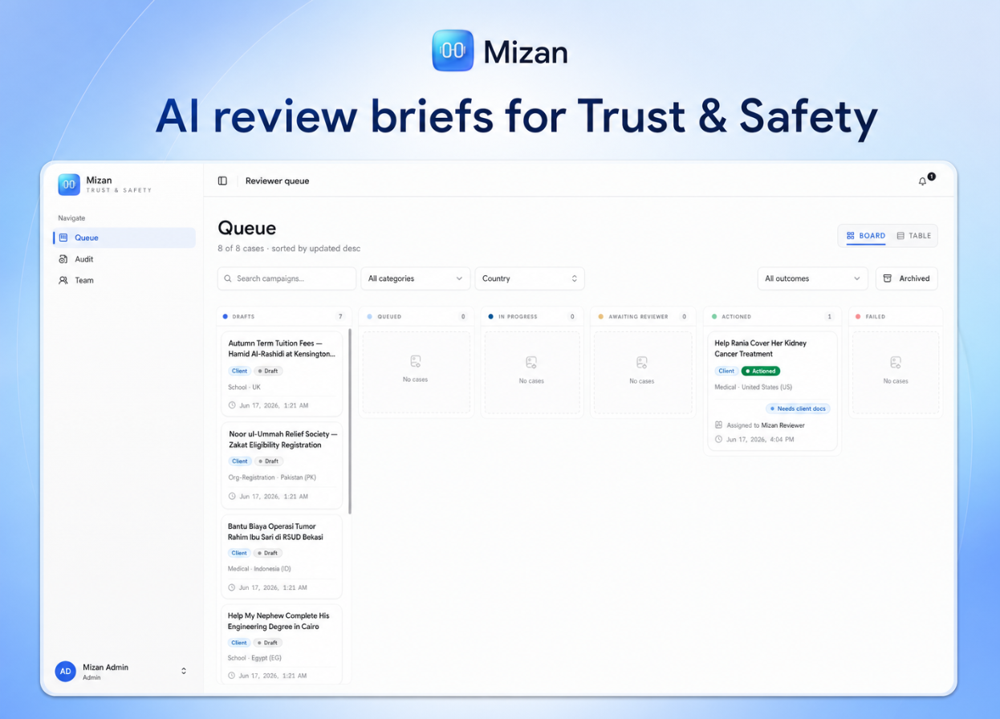

<div align="center">



# Mizan

**An AI Trust & Safety review console for fundraising platforms.**

Turn the campaign materials a team already collects into a cited, human-review
brief — in seconds instead of minutes. The AI surfaces evidence, matches policy,
and flags what's missing. The reviewer always decides.

[](./LICENSE)


</div>

---

## Table of contents

- [What it is](#what-it-is)
- [How it works](#how-it-works)
- [Highlights](#highlights)
- [Architecture](#architecture)
- [The review workflow](#the-review-workflow)
- [Tech stack](#tech-stack)
- [Repo layout](#repo-layout)
- [Prerequisites](#prerequisites)
- [Quick start](#quick-start)
- [Environment variables](#environment-variables)
- [Scripts](#scripts)
- [CI gates](#ci-gates)
- [Security posture](#security-posture)
- [Documentation](#documentation)
- [License](#license)

## What it is

A small Trust & Safety team reviewing fundraising campaigns does the same dance
for every case: read the story, open the organizer's ID and bank statement in
another tab, re-read the relevant policy in a third, work out what evidence is
missing, draft a request, log a decision. It runs about **12 minutes a case** —
and during peak periods (a charity platform's volume can double in Ramadan) the
queue buries a 10-person team.

Mizan does the digging. Given the materials already on file — creator ID,
beneficiary ID, bank statement, category-specific documents, the campaign text —
it runs a multi-step workflow that extracts structured fields, matches claims
against the platform's own published policy via RAG, surfaces missing evidence
and trust-chain signals, and produces a **cited brief** with a recommended
action and a drafted organizer message.

The reviewer reads the brief, then **approves, requests more documents,
escalates, blocks, or overrides with a rationale**. The AI never decides — and
every action the reviewer takes becomes an eval case that guards against
regressions.

> **Origin & scope.** Mizan is a self-contained reference implementation,
> inspired by the real review workflow charity-fundraising Trust & Safety teams
> face. It ships with **synthetic seed data only** — no real applicant data and
> no live third-party integrations. KYC vendors, sanctions APIs, and
> reverse-image search are realistic mocks, clearly marked as such.

## How it works

```
1. A campaign creator submits materials through the client portal.
2. The case lands in the reviewer queue (filterable by country, category, status).
3. The reviewer opens a case and generates a brief.
4. A multi-step Mastra workflow runs: gates → extract → policy match → signals → brief.
5. The brief streams in live, fully cited, with a recommended action.
6. The reviewer acts — approve / request docs / escalate / block / override.
7. If docs are requested, the client uploads more and the workflow re-runs.
8. On approval the campaign goes live. Every action becomes an eval case.
```

## Highlights

- **🤖 Multi-step Mastra workflow.** Layered steps — deterministic gates (no LLM)
  → document extraction → policy match → trust-chain signals → brief composition —
  with a real human-in-the-loop `suspend()` / `resume()` gate, not a single prompt.
- **📚 Cited RAG over published policy only.** Claims are matched to specific
  policy clauses (stable `clauseId`) retrieved from a Vectorize index. Citations
  are verified against the corpus; a hallucinated clause is rejected. Interpretive
  questions are escalated, never answered.
- **🛡️ Reviewer Copilot.** A read-only assistant (`Cmd+Shift+K`) that answers
  questions across the queue, cases, policy, signals, and audit log with inline
  tool-call rendering. It surfaces; it **cannot** take an action — enforced and tested.
- **⏸️ Human-in-the-loop queue.** Approve / request-docs / escalate / block /
  override-with-rationale. The workflow literally suspends at the reviewer gate
  and resumes with the chosen action.
- **📡 Live + resumable streaming.** Briefs stream over SSE backed by a Durable
  Object, so a brief survives a disconnect and resumes instead of getting stuck.
- **🔌 Provider-agnostic LLM.** Every call routes through a `getModel()` factory
  over Anthropic / OpenAI / OpenRouter; swap providers with a single env var, and
  the brief shape stays stable.
- **📈 Observability + eval.** Opt-in, fail-closed Langfuse tracing (per-brief cost
  visible in the dashboard) plus a Vitest eval harness with an LLM-as-judge gold
  set that gates CI.
- **💸 Cost guardrails.** A global per-UTC-day cap on brief generation and copilot
  chat (`AI_DAILY_BRIEF_CAP` / `AI_DAILY_CHAT_CAP`) bounds spend on a shared
  deployment, independent of how many accounts hit it.
- **👥 Multi-tenant + RBAC.** Org-scoped data with `reviewer`, `admin`, and
  `client` roles. Clients submit and track their own campaigns and see only a
  friendly status + the drafted ask — never internal briefs, scores, or signals.
- **🔒 Supply-chain-hardened install.** Socket scanner, a 14-day release-age bake,
  blocked install scripts, exact pins, and a committed lockfile (see
  [Security posture](#security-posture)).

## Architecture

```
                          ┌──────────────────────────────┐
        Client portal ───►│      apps/web (React 19)      │
   (campaign creators)    │  Vite · Tailwind · shadcn/ui  │
                          │  TanStack Query/Router · RPC  │
                          └───────────────┬──────────────┘
                                          │  Hono RPC (typed) + SSE
                                          ▼
                          ┌──────────────────────────────┐
                          │   apps/worker (Cloudflare)    │
                          │   Hono · better-auth · queue  │
                          └───────────────┬──────────────┘
                                          │
              ┌───────────────────────────┼───────────────────────────┐
              ▼                           ▼                            ▼
   ┌────────────────────┐   ┌──────────────────────────┐   ┌────────────────────┐
   │  Mastra workflow   │   │      Cloudflare data      │   │  Reviewer Copilot  │
   │ ── steps ────────  │   │  D1 (Drizzle)  · R2 docs  │   │  read-only agent   │
   │ 1 gates (no LLM)   │   │  Vectorize (policy RAG)   │   │  7 read-only tools │
   │ 2 doc extraction   │   │  KV (caps/idempotency)    │   └────────────────────┘
   │ 3 policy match RAG │   │  Queues (Mode B jobs)     │
   │ 4 trust signals    │   │  Durable Object (stream)  │
   │ 5 compose brief    │   └──────────────────────────┘
   └─────────┬──────────┘
             │  suspend()                LLM via provider factory
             ▼                           (Anthropic / OpenAI / OpenRouter)
   Reviewer acts ──► resume(action) ──► audit log + eval case
             │
             └─────────►  Langfuse Cloud (opt-in, fail-closed tracing)
```

Everything runs on Cloudflare's edge. The only external dependencies are the LLM
provider and (optionally) managed Langfuse.

## The review workflow

| Step                       | What it does                                                                                                                             | LLM?  |
| -------------------------- | ---------------------------------------------------------------------------------------------------------------------------------------- | ----- |
| **1. Deterministic gates** | Hard structural checks (required docs present, name consistency, category × geography rules). Cheap cases route around the LLM entirely. | No    |
| **2. Document extraction** | Typed tools pull structured fields from ID, bank statement, and category docs; real EXIF parsing on images.                              | Yes   |
| **3. Policy match (RAG)**  | Embeds the case, retrieves matching policy clauses from Vectorize, builds a claim-to-clause table with verified citations.               | Yes   |
| **4. Trust-chain signals** | Account age, prior campaigns, identity-verified status, photo/AI-generation signals, vouching chain for unverifiable cases.              | Mixed |
| **5. Compose brief**       | Assembles the cited brief, a recommended action, ≤3 reviewer questions, and a drafted organizer message.                                 | Yes   |
| **HITL gate**              | Workflow `suspend()`s. Reviewer approves / requests docs / escalates / blocks / overrides. `resume(action)` records it as an eval case.  | —     |

## Tech stack

**Runtime & backend**

- **Cloudflare Workers** — edge runtime (5-minute CPU on Paid plan)
- **Hono** — HTTP framework + end-to-end-typed RPC client
- **better-auth** + **better-auth-cloudflare** — email/password auth, `reviewer` / `admin` / `client` roles, org scoping
- **Mastra** — workflow orchestration with layered steps and HITL `suspend`/`resume`

**AI & data**

- **Vercel AI SDK** — `streamText` / `generateObject`, behind a `getModel()` provider factory
- **LLM providers** — Anthropic, OpenAI, OpenRouter (env-var swappable)
- **Cloudflare D1** + **Drizzle ORM** + **drizzle-zod** — SQL database, single-source-of-truth schemas
- **Cloudflare Vectorize** — vector index for policy RAG (1536-dim, cosine)
- **Cloudflare R2** — object storage for uploaded documents (presigned read access)
- **Cloudflare Queues** — background brief jobs for disconnected clients (`max_concurrency: 3`)
- **Cloudflare KV** — daily AI caps + idempotency keys
- **Durable Objects** — durable, resumable brief streaming

**Frontend**

- **Vite** + **React 19** + **TypeScript** (strict)
- **Tailwind CSS 4** (Vite plugin) + **shadcn/ui**
- **TanStack Query** (server state) + **TanStack Router** (routing)
- **React Hook Form** + **zod** (forms + validation)
- **Hono RPC** (`hc<AppType>()`) for end-to-end type safety

**Observability & eval**

- **Langfuse Cloud** — tracing + per-brief cost (opt-in, fail-closed)
- **Vitest** — unit + integration (Miniflare: real D1/R2/Vectorize/Queue/KV bindings)
- **LLM-as-judge** gold set + cost ledger (`packages/eval`)
- **Playwright** — end-to-end tests; **MSW** — UI mocking

**Tooling & supply chain**

- **Bun** workspaces (committed `bun.lock`)
- **oxlint** + **oxfmt** (no ESLint, no Prettier)
- **knip** — dead-code gate
- **lefthook** — pre-commit + pre-push hooks
- **Socket** scanner + 14-day release-age bake + exact pins

## Repo layout

```
apps/worker/     Cloudflare Worker — Hono + Mastra + queue consumer + Durable Object
apps/web/        Vite + React 19 + Tailwind 4 + shadcn UI client
packages/db/     Drizzle schema + migrations + drizzle-zod
packages/mastra/ Mastra workflows, steps, tools, LLM provider factory, policy corpus
packages/shared/ Cross-workspace zod schemas + Hono AppType re-export
packages/eval/   Gold set + LLM-as-judge + cost ledger
docs/            solutions/ — decision records + post-mortems
scripts/         seed-users, seed-cases, embed-corpus, one-off utilities
```

## Prerequisites

- **Bun** `>= 1.3.11` (the `packageManager` field pins the exact dev + CI version)
- A **Cloudflare** account with Wrangler authenticated (`bunx wrangler whoami`).
  The Workers Paid plan ($5/mo) is required for Queues.
- At least one **LLM provider key** (OpenAI by default; Anthropic / OpenRouter
  also supported)
- `CLOUDFLARE_ACCOUNT_ID` exported in your shell (Wrangler reads it natively)

## Quick start

```bash
git clone https://github.com/1nder-labs/mizan.git
cd mizan

# bun install runs every package through the Socket security scanner + a
# 14-day minimumReleaseAge bake (bunfig.toml). The first install is the
# slowest because the scanner has no warm cache.
bun install

# Install scripts are blocked for dependencies, so install the git hooks once:
bunx lefthook install

# Copy the env templates and fill in your keys.
cp .env.example .env
cp apps/worker/.dev.vars.example apps/worker/.dev.vars
# Set CLOUDFLARE_ACCOUNT_ID in .env and your LLM key(s) in apps/worker/.dev.vars

# One-time: materialise the Drizzle schema into local D1. Both are idempotent.
bun run db:generate
bun run db:migrate:local

# Boot worker + web in parallel.
bun --filter '*' dev

# Optional: seed dev accounts (worker must be running), then cases + R2 fixtures.
bun run db:seed
bun run db:seed:r2 && bun run db:seed:cases

# Optional: embed the policy corpus into the Vectorize index for RAG.
bun run embed-corpus
```

Open:

- Worker health: `http://localhost:8787/health`
- Web app: `http://localhost:5173`

## Environment variables

Root-level config lives in `.env` (template: `.env.example`). Worker secrets and
local vars live in `apps/worker/.dev.vars` (template: `apps/worker/.dev.vars.example`);
in production they ship via `wrangler secret put`. Never commit either.

| Variable                                                        | Where                  | Purpose                                      |
| --------------------------------------------------------------- | ---------------------- | -------------------------------------------- |
| `CLOUDFLARE_ACCOUNT_ID`                                         | `.env`                 | Cloudflare account for Wrangler commands     |
| `DEFAULT_LLM_PROVIDER`                                          | `wrangler.jsonc` vars  | Active provider (`openai` by default)        |
| `ANTHROPIC_API_KEY` / `OPENAI_API_KEY` / `OPENROUTER_API_KEY`   | `.dev.vars`            | LLM provider keys                            |
| `BETTER_AUTH_SECRET`                                            | `.dev.vars`            | Auth signing secret                          |
| `REVIEW_ORG_ID`                                                 | `.dev.vars`            | Designated review org clients join on signup |
| `R2_ACCOUNT_ID` / `R2_ACCESS_KEY_ID` / `R2_SECRET_ACCESS_KEY`   | `.dev.vars`            | R2 presigned document reads                  |
| `AI_DAILY_BRIEF_CAP` / `AI_DAILY_CHAT_CAP`                      | env (optional)         | Daily AI usage caps (defaults: 50 / 200)     |
| `LANGFUSE_HOST` / `LANGFUSE_PUBLIC_KEY` / `LANGFUSE_SECRET_KEY` | `.dev.vars` (optional) | Observability — all three or tracing is off  |

## Scripts

```bash
bun --filter '*' dev    # worker + web in parallel
bun run db:generate     # generate Drizzle migration from schema changes
bun run db:migrate:local# apply migrations to local D1
bun run db:seed         # seed dev reviewer + admin accounts
bun run db:seed:cases   # seed documentary cases
bun run db:seed:r2      # seed R2 document fixtures (local)
bun run embed-corpus    # embed policy corpus into Vectorize
bun run eval            # run the eval harness
bun run deploy          # deploy the worker (Phase 10)
```

## CI gates

Run these locally before pushing — all must exit 0 before a merge:

```bash
bun run lint          # oxlint — the non-negotiable rule set
bun run format:check  # oxfmt
bun run typecheck     # tsc --noEmit per workspace
bun run knip          # dead-code detector
bun run audit         # bun audit — HIGH/CRITICAL gate
bun --filter '*' test # vitest + miniflare integration suite
```

A lefthook **pre-commit** hook runs lint + typecheck + knip + audit + a grep gate
that rejects `as any`, `as unknown`, `: any`, `// TODO|FIXME|HACK|XXX`, and
`// @ts-nocheck` in staged non-test source. The **pre-push** hook runs the full
test suite.

**Coding standards** (CI-enforced): files ≤ 400 LOC, functions ≤ 50 LOC, no
`any` / no `as`, no inline comments (only JSDoc), no dead code, drizzle-generated
migrations only.

## Security posture

The supply-chain stack is enforced at install time, not in policy documents:

- **Bun Security Scanner API** — the Socket scanner blocks malicious / hijacked /
  typosquatted packages before they link (`bunfig.toml` `[install.security]`).
- **14-day bake period** — `install.minimumReleaseAge` rejects any version
  published less than 14 days ago, defeating rapid-publish attack patterns. A
  small allowlist of high-cadence first-party packages bypasses the bake.
- **No lifecycle scripts** — `install.ignoreScripts = true` blocks postinstall
  code; `trustedDependencies` is the explicit, reviewed allowlist.
- **Exact pins everywhere** — `install.exact = true`; `bun.lock` snapshots
  transitive resolution; CI runs `bun install --frozen-lockfile --no-cache`.

Observability is **managed Langfuse Cloud**, wired through the AI SDK's
`experimental_telemetry` and the `@mastra/langfuse` exporter. It is **fail-closed
and opt-in**: the exporter activates only when all of `LANGFUSE_HOST`,
`LANGFUSE_PUBLIC_KEY`, and `LANGFUSE_SECRET_KEY` are set — otherwise it returns
null and tracing is silently skipped (zero overhead, no network calls). Spans can
carry campaign PII, so only point a project at real data behind span masking and
proper sign-off. **Use the synthetic seed data otherwise.**

## Documentation

Architecture decision records and post-mortems live under
[`docs/solutions/`](./docs/solutions/) — covering supply-chain baselines,
streaming/durability patterns, and testing approaches.

## License

[MIT](./LICENSE) © Lahfir
